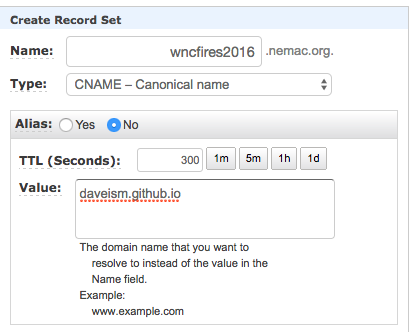

[[Back to start]](github.md)&nbsp;&nbsp;&nbsp;&nbsp;[[Go to previous step]](GitHub_step6.md)
&nbsp;&nbsp;&nbsp;&nbsp;[ArcGIS Online My Content](http://www.arcgis.com/home/content.html)

# Step 7: Using your domain or subdomain

After completing [Step 6](GitHub_step6.md), let's go one step further and add a domain to the website. That way, the map viewer will appear to be part of organization's website.

> Okay, you caught me. You might have to pay a few dollars if you need to buy a domain. I will assume you already did this, so the cost remains $0. Also, you might need I.T.'s help. But it's easy. I promise.

**On GitHub go to "Settings"**

- Scroll down to the GitHub Pages section.
- Look for the section called `Custom Domain`.
- In the Custom Domain text box, add the text for a subdomain. I am using `wncfires2016.nemac.org`.
> For your site, the `nemac.org` will change.

- Click `Save`.

There should be a new file in your repository named `CNAME`. It contains the text you entered as a subdomain `wncfires2016.nemac.org`.

Add a CNAME record according to the DNS provider's directions. There are just too many providers for me to go over each one. Here is an example of what the CNAME looks like using Amazon's Route 53.

Finally, the viewer has some hard coding. We need to fix it. Change this [line](https://gist.github.com/daveism/d9d2cf2d34c5ee9b540ec5ca8abf4dab/revisions?diff=split) in the file `index.html`.

Now, navigate to the URL. In my case, it's `wncfires2016.nemac.org`.

**DONE** 

[boom](boom.md)
